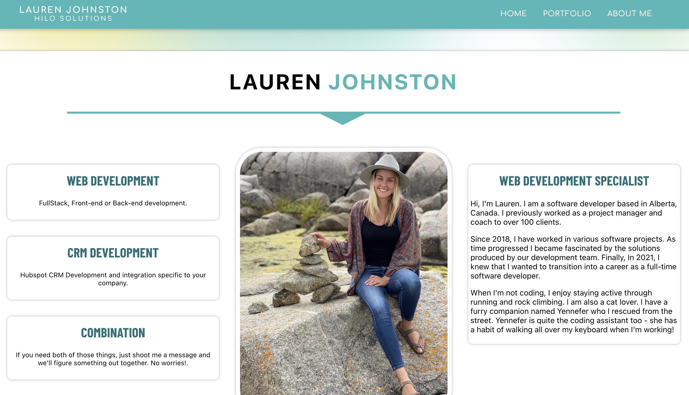
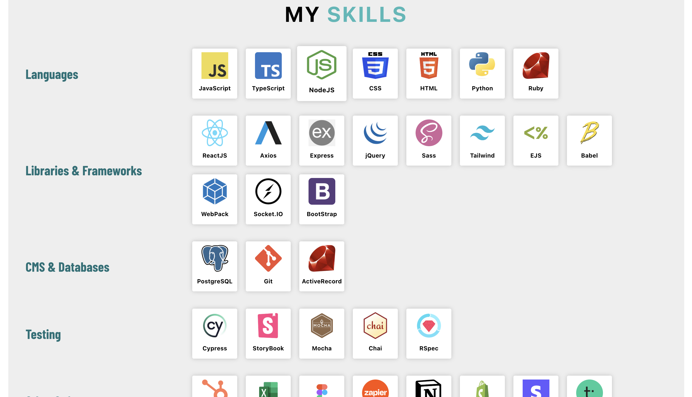
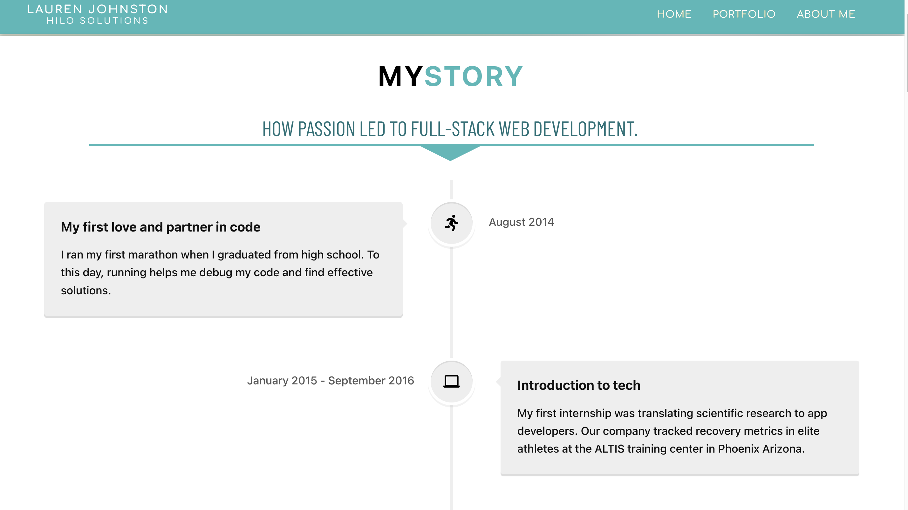
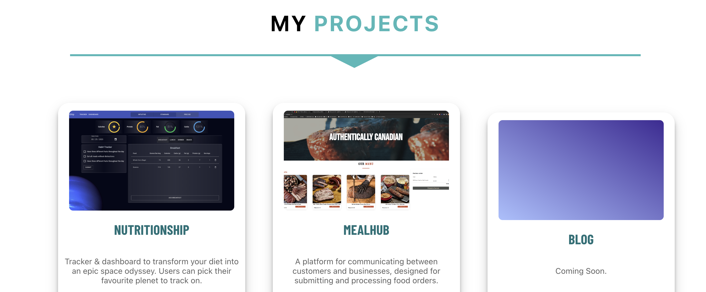
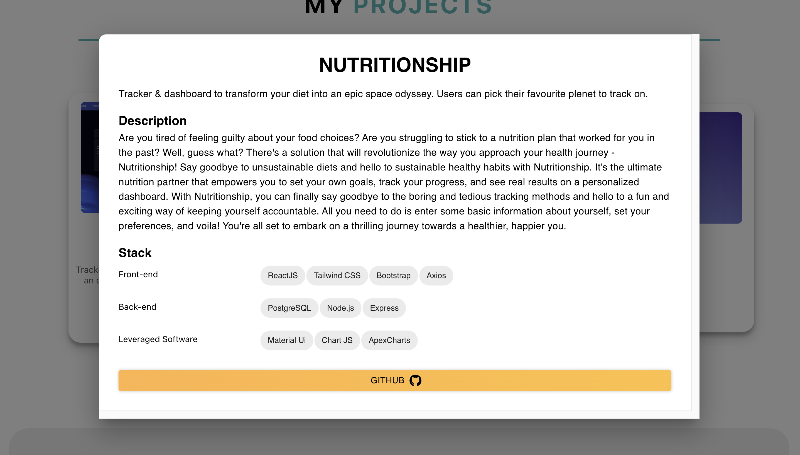
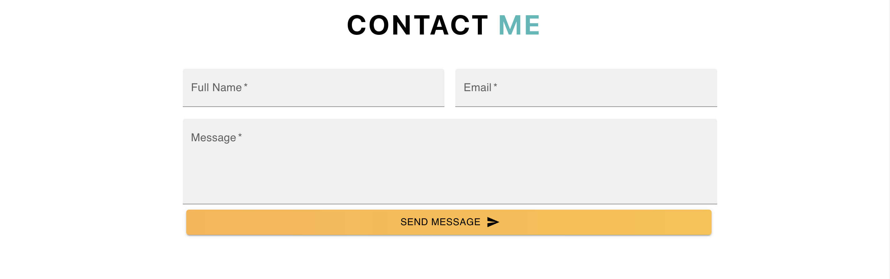

# My Portfolio Website

>I kept my portfolio website simple, but added fun and professional animations to challenge myself. My portfolio is a space for new ideas and self-expression. My favorite feature is the header, which features a moving gradient created by constructing circles in React, applying physics principles for bouncing motion, enlarging them for overlap, and adding a blur effect to the canvas.

## Author

**Lauren Johnston** 
* *Initial work* - [saved-portfolio-site](https://github.com/HiloSolutions/saved-portfolio-site/tree/main) (Repository space)
* *Released on* Netlify
* *Hosted on* TBD
* *My professional profile on* [LinkedIn](https://www.linkedin.com/in/lauren-e-johnston/)

## Showcase

This project was designed to demonstrate:

* ReactJS
  * This frontend website is made using react.
* Google API
  * The contact form is configured using the google email API.

## Usage example

### Home Page

### My Skills
If you are curious about the technologies I am most familiar with, you can view my skills on all pages.

### My Story
My path to becoming a developer is unconventional. However, my journey began long before I received my diploma. On this page, I'm not just sharing my resume experience, but also the story of how I decided to become a developer after working in startups and on development teams for many years.

### My Projects
Go to the 'Portfolio' page to see my projects!

GitHub is a great platform for showcasing my projects, but I wanted my website to present them in a way that's easy for people who aren't familiar with it. By clicking the "view details" button on each portfolio card, you can see the stack I used and a description of the project.

### Contacts Me
You can send me an email on my website. The contact form is found at the bottom of each page.

